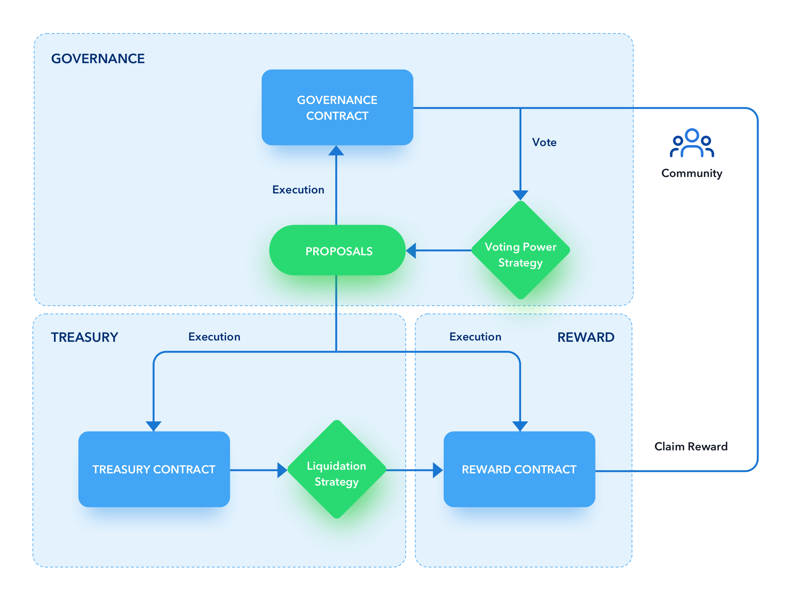

# KyberDao Katana

## Architecture



### General Information

The overall architecture is based off Aave's governance model with some notable modifications:

- enabling the creation and voting on multi-option (generic) proposals
- pulling voting power from the KyberStaking contract instead of a token contract
- permissioned roles like `owner` & `guardian` have been replaced by `admin` and `daoOperator` with new authorization scopes
- block timestamps utilised instead of block numbers

### KyberGovernance

Handles the queueing, creation, cancellation and vote submissions for binary and generic proposals.

- executors whitelisted: Executor (short) and Executor (long)
- admin (able to authorize/unauthorize executors and voting strategies): Executor (long)
- daoOperator (able to create and cancel proposals): Kyber multisig

### Executor (short)

- admin (the only address enable to interact with this executor): KyberGovernance
- delay (time between a proposals passes and its actions get executed): 12 hours
- grace period (time after the delay during which the proposal can be executed): 4 days
- minimum voting duration: 4 days
- maximum voting options: 8
- vote differential: 0.01%
- quorum: 4%

### Executor (long)

Controls upgradeability of the new KNC token contract, and any change in key parameters of KyberGoverance or itself

- admin: KyberGovernance
- delay: 1 week
- grace period: 7 days
- minimum voting duration: 7 days
- maximum voting options: 8
- vote differential: 4%
- quorum: 15%

### KyberVotingPowerStrategy

Calculates voting power from KNC stakes in KyberStaking. Also handles epoch validation checks for proposal creations. Will call KyberGovernance to modify vote counts due to KNC staking withdrawals.

- maxVotingPower: total KNC supply at time of proposal creation

### ProposalValidator (inherited by executors)

Validates the creation and cancellation of proposals. Also determines resolutions to binary proposals.

## Setup

1. Clone this repo
2. `yarn install`

## Contract Addresses

### Mainnet

KNC Token: `0xdeFA4e8a7bcBA345F687a2f1456F5Edd9CE97202`  
KNC Implementation: `0xe5E8E834086F1a964f9A089eB6Ae11796862e4CE`  
KyberStaking: `0xeadb96F1623176144EBa2B24e35325220972b3bD`  
KyberGovernance: `0x7Ec8FcC26bE7e9E85B57E73083E5Fe0550d8A7fE`  
Short Executor: `0x41f5D722e6471c338392884088bD03340f50b3b5`  
Long Executor: `0x6758A66cD25fef7767A44895041678Fc4Ae9AfD0`  
Voting Power Strategy: `0xfbd73581af42b26295CF4B88B74A5AF71F209F8b`  
Treasury: `0x0E590bB5F02A0c38888bFFb45DeE050b8fB60Bda`  
Reward Distributor: `0x5EC0DcF4f6F55f28550c70B854082993fdc0D3B2`  
Reward Pool: `0xD2D0a0557E5B78E29542d440eC968F9253Daa2e2`  
FeeHandler: `0x9Fb131eFbac23b735d7764AB12F9e52cC68401CA`  
DAO Multisig - Treasury: `0x91c9D4373B077eF8082F468C7c97f2c499e36F5b`
- The DAO Multisig - Treasury is deployed on: Ethereum, Arbitrum, Optimism, Polygon, BNB Chain, Avalanche, Fantom, BitTorrent, Cronos.

### Ropsten

KNC Token: `0xbe87E5634f9FC7cD3ED88ad58b1462F3C5A7EB5b`  
KNC Implementation: `0x7d66b55ec22c8c01d05ec9fc361228543c679798`  
KyberStaking: `0x6A345cdaBA1B34cC74b877530CF28aD43b2bF2C7`  
KyberGovernance: `0xef5a1404E312078cd16B7139a2257eD3bb42F787`  
Short Executor: `0x0F7aDBaa49E88097fe6f1258cB3C78d117fc6F6B`  
Long Executor: `0x2b554Bfb76c5A8dDD85E686DEa06b878EEC8f367`  
Voting Power Strategy: `0x7646A525258bc5f6f200A811F8F4e85efB50e025`  
Treasury: `0x7E945866e588C99fCbd42184F74F26e678869457`  
Reward Distributor: `0x3c25D80F41c41daa574f4dCD3Eaf3C9851962C1a`  
Reward Pool: `0xc278824e38870C47356A8335979065264A6fD2FB`  
FeeHandler: `0x11bcE71CC3F65E08D1bEDfCa5c1625979728B9bA`

## Compilation

`yarn c` to compile contracts for all solidity versions.

## Contract Deployment / Interactions

For interactions or contract deployments on public testnets / mainnet, create a `.env` file specifying your private key and infura api key, with the following format:

```
PRIVATE_KEY=0x****************************************************************
INFURA_API_KEY=********************************
```

## Testing with Hardhat

1. If contracts have not been compiled, run `yarn c`. This step can be skipped subsequently.
2. Run `yarn test`
3. Use `./tst.sh -f` for running a specific test file.

### Example Commands

- `yarn test` (Runs all tests)
- `./tst.sh -f ./test/kyberGovernance.js` (Test only kyberGovernance.js)

### Example

`yarn hardhat test ./test/kyberGovernance.js`

## Coverage

`yarn coverage` (Runs coverage for all applicable files)
